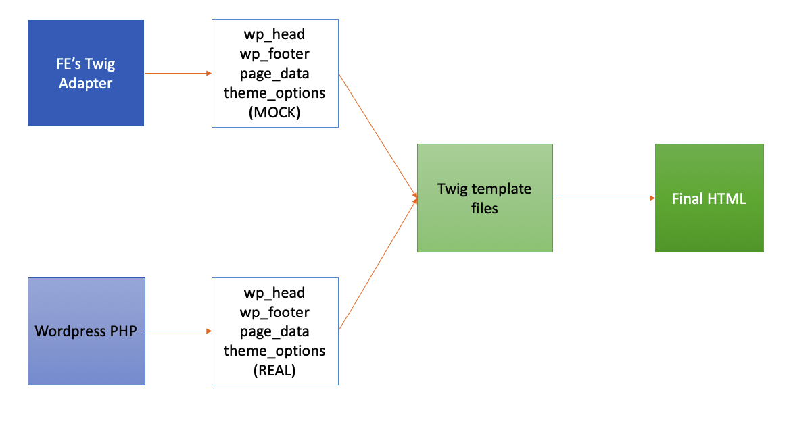
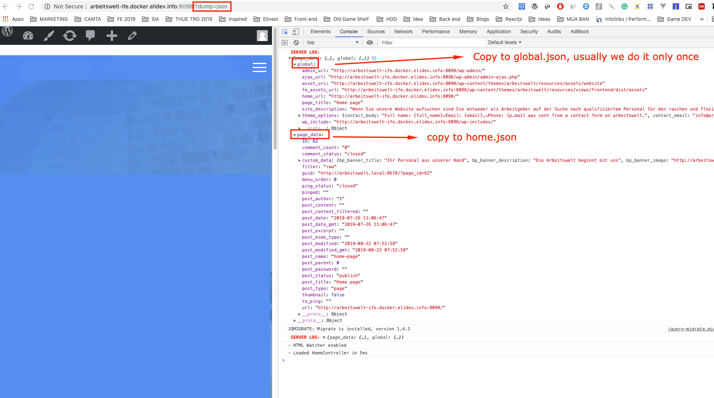

# How to integrate with Wordpress data

## How it works
- Our FE team has sliced the static HTML by twig template. BE team will directly reuse our files to do real render with Wordpress data.

- FE guys understand the templates deeply. Therefore, the work of "map data to view"  will be done by them. 
To speed up this process we created Webpack Twig Adapter to fake functions and data which are exactly the same as BE provided samples. 

- The following is a description for this idea:

 

## Setup

- Switch to **dev-integrate-fe** GIT branch.
- Setup Wordpress - docker environment. (follow readme.md in project root)

## Start working

1. Run frontend adapter: `yarn start` (Same as normal FE development)

2. Goto PHP page which need integration. 

3. Dump real `page_data` by appending ?dump=json. Then check the console.log.

4. Sync `page_data` from backend to our json files (located in `src/adapter/mocks`)
    * The json file in `pages` folder must be named the same as twig file in `views`
    * BE's dump return a lot of data, we should delete some and only get necessary fields

5. Map data to view: data will be available in variables: `global, page_data`

6. After completely integrate with mock data. Run the page in real PHP to see the result. And handle mismatch if any.

## Example of dump

 
